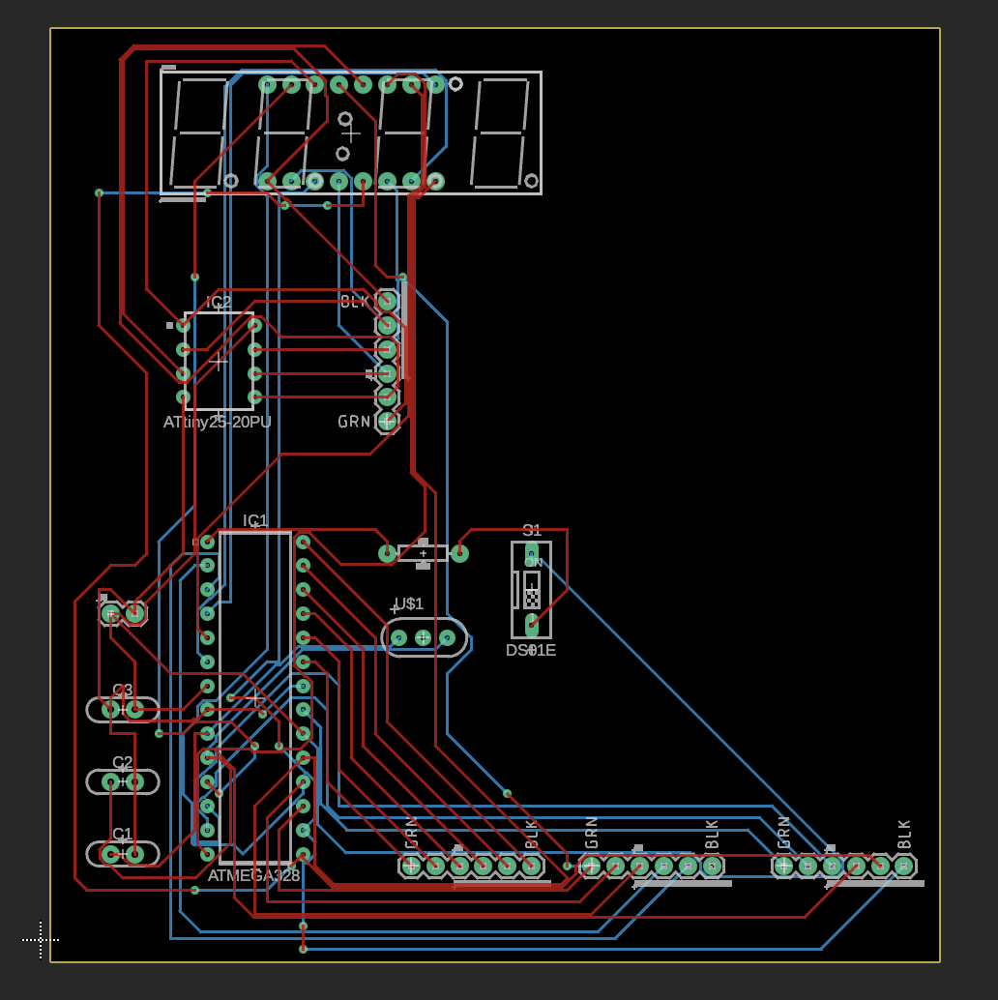

# ATMEGA-ATTINY-DevBoard

### Circuit Schematic

### PCB Design Layout

### 3D Model Visualization

The purpose of this Fusion DevBoard is to control a set of Seven-Segment displays, with the ATTINY focusing on it's own section. With a header pinout to the majority of each microcontroller's pins, it allows the DevBoard user to load custom on it to build flexible systems.

The ATMEGA328P Chip is connected to a reset button with a 10K ohm resistor, (2x) 22 pf Ceramic Capacitors, a 10 uF polarized capacitor, and a 16 mHZ crystal oscillator for the clock signal. This forms a basic circuit, which is attached to a ATTINY85 chip used to control the (4x) Seven-Segment Display, allowing the user to control that through custom code.
